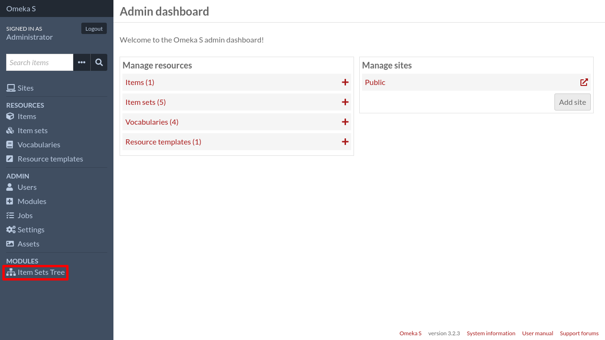

Define the item set hierarchy
=============================

To define the item set hierarchy, log in to the admin interface and click on
``Item Sets Tree`` in the left sidebar, under the ``Modules`` section.

The item sets tree will be shown (it will be flat if it's your first time using
the module)

.. image:: images/item-sets-tree-flat.png

Click on the ``Edit`` button in the top right corner of the page. You are now
in "edit" mode.

.. image:: images/item-sets-tree-edit-flat.png

You can drag and drop item sets to organize them in the way you want. For instance:

.. image:: images/item-sets-tree-edit-tree.png

Once you are done, click on the ``Save`` button.

.. image:: images/item-sets-tree-tree.png
